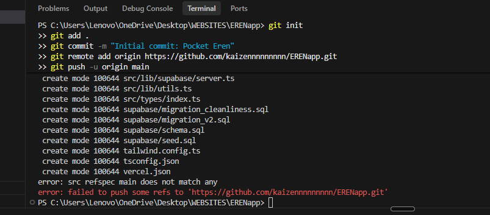

# Pocket Eren — Complete Setup Guide

## 1. Install dependencies

```bash
cd ERENapp
npm install
```

---

## 2. Supabase Setup

### 2a. Create a project

1. Go to [supabase.com](https://supabase.com) → **New project**
2. Pick a name (e.g. `pocket-eren`), set a strong DB password, choose your region
3. Wait ~2 minutes for the project to spin up

### 2b. Run the SQL schema

1. In your Supabase dashboard → **SQL Editor** → **New query**
2. Paste the entire contents of `supabase/schema.sql`
3. Click **Run**
4. Then paste `supabase/seed.sql` and run that too

### 2c. Enable Realtime

In Supabase Dashboard → **Database** → **Replication** → enable these tables:
- `eren_stats`
- `interactions`
- `daily_moods`
- `reminders`

Or run in SQL Editor:
```sql
ALTER PUBLICATION supabase_realtime ADD TABLE public.eren_stats;
ALTER PUBLICATION supabase_realtime ADD TABLE public.interactions;
ALTER PUBLICATION supabase_realtime ADD TABLE public.daily_moods;
ALTER PUBLICATION supabase_realtime ADD TABLE public.reminders;
```

### 2d. Create Storage buckets

In Supabase Dashboard → **Storage** → **New bucket**:

| Bucket name | Public | Purpose             |
|-------------|--------|---------------------|
| `memories`  | ✅ Yes  | Memory photos       |
| `avatars`   | ✅ Yes  | Profile pictures    |

Or run in SQL Editor:
```sql
insert into storage.buckets (id, name, public) values ('memories', 'memories', true);
insert into storage.buckets (id, name, public) values ('avatars', 'avatars', true);
```

Add storage policies (SQL Editor):
```sql
-- Anyone in same household can upload to memories
create policy "Household members can upload memories"
  on storage.objects for insert
  with check (bucket_id = 'memories' AND auth.role() = 'authenticated');

create policy "Memories are publicly readable"
  on storage.objects for select
  using (bucket_id = 'memories');

-- Avatars
create policy "Users can upload own avatar"
  on storage.objects for insert
  with check (bucket_id = 'avatars' AND auth.role() = 'authenticated');

create policy "Avatars are publicly readable"
  on storage.objects for select
  using (bucket_id = 'avatars');
```

### 2e. Get your API keys

Supabase Dashboard → **Settings** → **API**:
- Copy **Project URL**
- Copy **anon public** key

---

## 3. Environment variables

Create `.env.local` in the project root:

```env
NEXT_PUBLIC_SUPABASE_URL=https://your-project-id.supabase.co
NEXT_PUBLIC_SUPABASE_ANON_KEY=your-anon-key-here
NEXT_PUBLIC_APP_URL=http://localhost:3000

# For the stat-decay cron job (make up a random string)
CRON_SECRET=any-random-secret-string-here
```

---

## 4. Run locally

```bash
npm run dev
```

Open [http://localhost:3000](http://localhost:3000)

---

## 5. First-time usage

1. Register **your** account → choose **"Create home"** → note the invite code
2. Register **your girlfriend's** account → choose **"Join home"** → paste invite code
3. Both accounts are now linked to the same Eren!

---

## 6. Deploy to Vercel

### 6a. Push to GitHub

```bash
git init
git add .
git commit -m "Initial commit: Pocket Eren"
git remote add origin https://github.com/kaizennnnnnnnn/ERENapp.git
git push -u origin main
```

### 6b. Import to Vercel

1. Go to [vercel.com](https://vercel.com) → **Add New Project**
2. Import your GitHub repo
3. Framework: **Next.js** (auto-detected)
4. Add environment variables (same as `.env.local` but with your production URL):

| Key | Value |
|-----|-------|
| `NEXT_PUBLIC_SUPABASE_URL` | `https://xxx.supabase.co` |
| `NEXT_PUBLIC_SUPABASE_ANON_KEY` | your anon key |
| `NEXT_PUBLIC_APP_URL` | `https://your-app.vercel.app` |
| `CRON_SECRET` | your random secret |

5. Click **Deploy**

### 6c. Set Supabase redirect URL

In Supabase Dashboard → **Authentication** → **URL Configuration**:
- **Site URL**: `https://your-app.vercel.app`
- **Redirect URLs**: `https://your-app.vercel.app/auth/callback`

### 6d. Cron job (stat decay)

The `vercel.json` already configures a cron that hits `/api/decay` every hour.
This slowly decreases Eren's stats so you're motivated to check in regularly.

> Note: Cron jobs require Vercel Pro or a Hobby plan with the feature enabled.

---

## 7. Making the app installable (PWA)

After deploy, users can visit the site on their phone and:
- **iOS**: Safari → Share → "Add to Home Screen"
- **Android**: Chrome → Menu → "Add to Home Screen" / "Install app"

The `public/manifest.json` and viewport settings are already configured.

---

## 8. Database maintenance

### Reset Eren's stats manually

```sql
update public.eren_stats
set happiness = 80, hunger = 80, energy = 80, sleep_quality = 80, mood = 'idle'
where household_id = 'your-household-id';
```

### View all interactions

```sql
select p.name, i.action_type, i.created_at
from interactions i
join profiles p on p.id = i.user_id
order by i.created_at desc
limit 50;
```

---

## 9. Project structure

```
ERENapp/
├── src/
│   ├── app/
│   │   ├── (app)/             ← Protected routes (auth required)
│   │   │   ├── home/          ← Main screen with Pixel Eren + stats
│   │   │   ├── care/          ← Care actions + reminders
│   │   │   │   └── reminders/ ← Reminder management
│   │   │   ├── games/         ← Mini-games hub
│   │   │   │   ├── catch-mouse/
│   │   │   │   ├── yarn-chase/
│   │   │   │   └── paw-tap/
│   │   │   ├── memories/      ← Photo + text memories
│   │   │   └── profile/       ← User profile, invite code, time tracking
│   │   ├── api/
│   │   │   └── decay/         ← Hourly stat decay cron endpoint
│   │   └── auth/
│   │       ├── login/
│   │       ├── register/
│   │       └── callback/
│   ├── components/
│   │   ├── PixelEren.tsx      ← The star! Pixel art Ragdoll cat
│   │   ├── StatBar.tsx        ← Animated stat bars
│   │   ├── BottomNav.tsx      ← Mobile bottom navigation
│   │   ├── MoodPicker.tsx     ← Daily mood check-in
│   │   └── MoodCalendar.tsx   ← Monthly mood calendar
│   ├── hooks/
│   │   ├── useErenStats.ts    ← Realtime stats + action handler
│   │   ├── useAuth.ts         ← Auth state
│   │   └── useTimeTracking.ts ← Session time tracking
│   ├── lib/
│   │   ├── supabase/
│   │   │   ├── client.ts      ← Browser Supabase client
│   │   │   └── server.ts      ← Server Supabase client
│   │   └── utils.ts           ← Helpers
│   └── types/
│       └── index.ts           ← All TypeScript types + configs
├── supabase/
│   ├── schema.sql             ← Full DB schema + RLS
│   └── seed.sql               ← Starter data
├── public/
│   └── manifest.json          ← PWA manifest
├── middleware.ts               ← Auth redirect guard
├── vercel.json                 ← Cron job config
└── .env.local.example         ← Env var template
```

---

## 10. How the two-user system works

```
households
    id: "11111111-..."
    name: "Eren's Home"
    invite_code: "ERENHOME"

profiles (you)               profiles (girlfriend)
    household_id: "11111111" ←→   household_id: "11111111"
    name: "Alex"                  name: "Jordan"

eren_stats
    household_id: "11111111"  ← ONE row, shared by both users
    happiness: 85
    hunger: 70
    ...

interactions
    user_id: Alex's ID → "fed Eren"
    user_id: Jordan's ID → "played with Eren"
```

Both users see the same Eren stats in real time via Supabase Realtime.
All actions are logged with who did them.

---

## Customizing the Pixel Art

The pixel art is in `src/components/PixelEren.tsx`.

Each mood has a 20×24 character grid. Each character maps to a color:

| Char | Color | Meaning |
|------|-------|---------|
| `C` | `#F9EDD5` | Cream/white body |
| `M` | `#9B7A5C` | Brown mask/markings |
| `K` | `#4A2E1A` | Dark brown (ear tips) |
| `E` | `#6BAED6` | Ragdoll blue eyes |
| `P` | `#1A1A2E` | Pupils |
| `N` | `#F48B9B` | Pink nose |
| `.` | transparent | Background |

To add a new mood, add an entry to the `FRAMES` object and update the `ErenMood` type.
